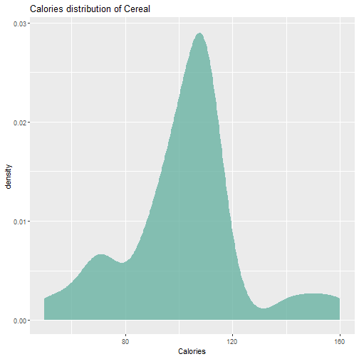

<style>
width: 1500
height: 900
</style>

Presentation
========================================================
author: Leyre Sastre
date: March 2021
autosize: true
font-import:https://fonts.googleapis.com/css2?family=Playfair+Display&display=swap
font-family: 'Playfair Display'
css:custom.css 
transition: fade
transition-speed: slow
incremental: true
Data set
========================================================
type: section 
incremental: true
transition: fade

This task consists in choosing a data set and present a few of its characteristics. We have chosen the data set Cereal. It contains information about types of cereals and nutritional data depending the cereal type. The variables are: 

<li class="fragment fade-in">Cereal: brandname of the cereal.</li>
<li class="fragment fade-in">Calories: calories per serving.</li>
<li class="fragment fade-in">Sugar: grams of sugar per serving.</li>
<li class="fragment fade-in">Fiber: grams of fiber per serving.</li>

Data set
========================================================
type: section 
transition: true
Here we can see the first six entries of the data set: 


```
                 Cereal Calories Sugar Fiber
1 Common Sense Oat Bran      100     6     3
2            Product 19      100     3     1
3   All Bran Xtra Fiber       50     0    14
4            Just Right      140     9     2
5     Original Oat Bran       70     5    10
6             Heartwise       90     5     6
```

Statistics Summary
========================================================
type: section 
transition: true
Here we can see the main statistical parameters of the numerical variables: 


```
    Calories         Sugar            Fiber       
 Min.   : 50.0   Min.   : 0.000   Min.   : 0.000  
 1st Qu.: 90.0   1st Qu.: 1.750   1st Qu.: 1.000  
 Median :104.0   Median : 5.000   Median : 3.000  
 Mean   :101.6   Mean   : 5.714   Mean   : 3.592  
 3rd Qu.:110.0   3rd Qu.: 9.075   3rd Qu.: 4.250  
 Max.   :160.0   Max.   :15.000   Max.   :14.000  
```


Interactive Correlation Matrix
========================================================
type: section 
transition: false


<style>
  .p_iframe iframe {
    width:90%;
    height:576px;
}
</style>

<div class="p_iframe">
<iframe frameborder="0" seamless='seamless' scrolling=no src="plotly.html"></iframe>
</div>

Density of calories
========================================================
type: section 
transition: true


